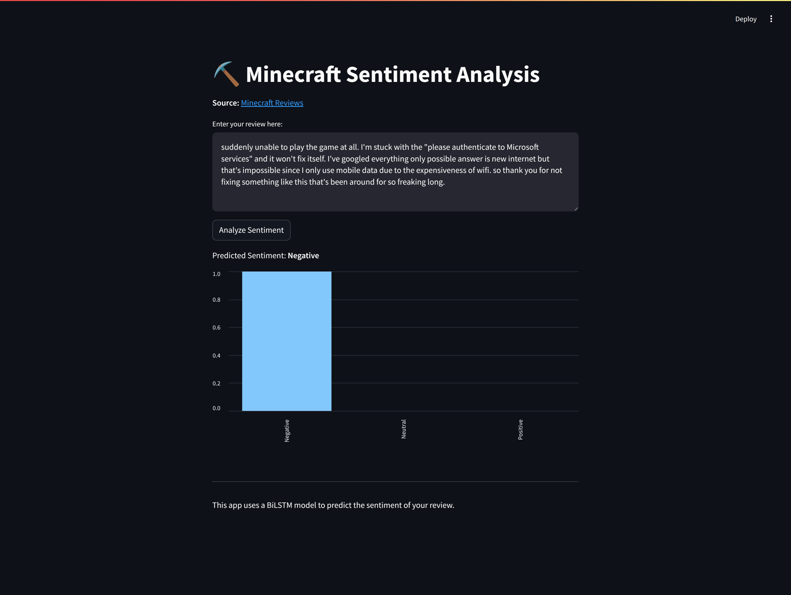

# ⛏️ Minecraft Sentiment Analysis
**This project aims to classify the sentiment (negative, neutral, positive) of Minecraft game reviews on the Play Store**. By analyzing the reviews, we can gain insights into the overall user sentiment towards the game and identify areas for improvement. The classification model will help categorize the reviews accurately, enabling developers to make data-driven decisions to enhance the gaming experience.

## 🗂️ Dataset
**This project utilizes a dataset of over 63,000 reviews scraped from the Play Store**. After performing extensive data cleaning and addressing the issue of unbalanced data, the final dataset consists of a total of **16,449 reviews**. This refined dataset will be used for sentiment classification, allowing for accurate analysis of user sentiment towards the Minecraft game. You can see the code used to scrape the data in [this notebook](Minecraft_Sentiment_Analysis.ipynb)

## 📚 Libraries
The project uses the following libraries:
- Scraping the reviews from the Play Store using the `google-play-scraper` library
- Performing natural language processing tasks with the `nltk` library
- Performing sentiment analysis using the `textblob` library
- Handling numerical operations with the `numpy` library
- Manipulating and analyzing data using the `pandas` library
- Visualizing data using the `matplotlib` library
- Creating visualizations with the `seaborn` library
- Generating word clouds using the `wordcloud` library
- Implementing machine learning models with the `scikit-learn` library
- Building deep learning models with the `tensorflow` library

## 🛠️ Methodology
The sentiment analysis process involves several key steps, including data preprocessing, labelling, imbalance data handling, feature extraction, and model training. The dataset is preprocessed to remove noise, and tokenize the text. The text data is then transformed into feature vectors using techniques such as TF-IDF and Tokenizer. These features are fed into machine learning and deep learning models such as **Logistic Regression, Naive Bayes, K-Nearest Neighbors, Decision Tree, Random Forest, LSTM, and Bi-LSTM** for sentiment classification.

## 📈 Results
As you can see in the [notebook](Minecraft_Sentiment_Analysis.ipynb), the sentiment classification models were evaluated using different methodologies and achieved the following accuracy scores:

1. Experiment 1 (Logistic Regression + 90-10): 87.23%
2. Experiment 1 (Decision Tree + 90-10): 82.31%
3. Experiment 1 (Random Forest + 90-10): 80.18%
4. Experiment 1 (Naive Bayes + 90-10): 64.44%
5. Experiment 1 (K-Nearest Neighbors + 90-10): 47.23%
6. Experiment 2 (Bi-LSTM + 80-20): 91.34%
7. Experiment 2 (LSTM + 80-20): 91.03%
8. Experiment 3 (CNN + 70-30): 90.06%

These results demonstrate the effectiveness of the models in accurately classifying the sentiment of Minecraft game reviews. **The highest accuracy was achieved by Experiment 2, which utilized a Bi-LSTM model with a 80-20 train-test split**.

## 🚀 Streamlit Web App

The project also includes a Streamlit web app that allows users to input their own review and receive a sentiment prediction. The app is can be accessed [here](https://minecraft-ai.streamlit.app/).